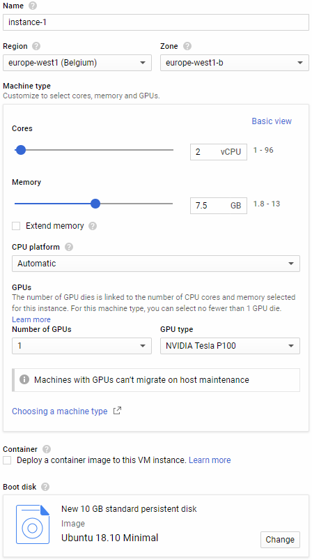
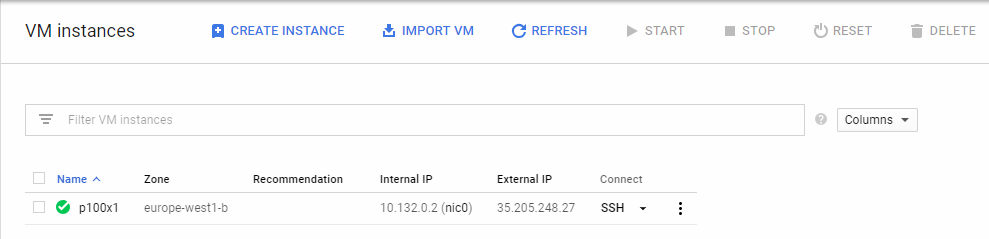

# Google Compute Engine Setup

Google Cloud Platform's [Compute Engine](https://console.cloud.google.com/compute/) offers $300 free credit.

A custom instance with two threads and a single P100 GPU seems to be the best overall instance for cracking everything apart from Argon2. Certain regions such as `europe-west2` will **not** allow you to access a GPU instance.

I would recommend `europe-west1`.

You are limited to a single GPU across all instances unless you request a limit increase.

#### Setup

Create a new [VM instance](https://console.cloud.google.com/compute/instances) with the following specs:



SSH into the instance.



Update all packages first and install build dependencies:

```
sudo apt update
sudo apt upgrade
sudo apt install build-essential linux-image-extra-virtual
```

Install NVIDIA Tesla P100 drivers:

```
wget http://uk.download.nvidia.com/tesla/410.72/NVIDIA-Linux-x86_64-410.72.run
sudo /bin/bash NVIDIA-Linux-x86_64-410.72.run
```

If that version fails,`NVIDIA-Linux-x86_64-396.44.run` is reliable.

You may need to restart the instance after installing drivers.


Install [JohnTheRipper](https://www.openwall.com/john/):

```
sudo apt install build-essential libssl-dev git zlib1g-dev yasm libgmp-dev libpcap-dev pkg-config libbz2-dev nvidia-opencl-dev

git clone git://github.com/magnumripper/JohnTheRipper -b bleeding-jumbo jtr

cd jtr/src/
./configure && make -s clean && make -sj4
```

Install [Hashcat](https://hashcat.net/hashcat/):

```
sudo apt install hashcat
```

And you're done!
Don't forget to stop your instance when you're not using it.
